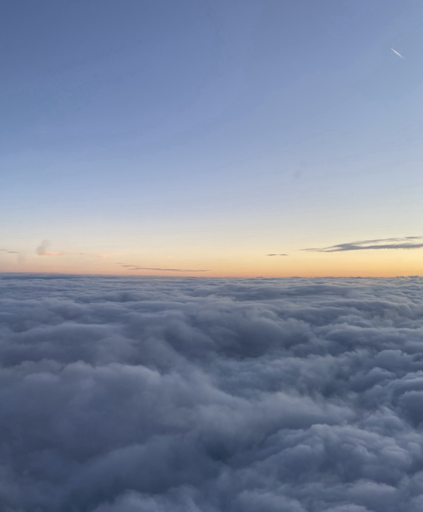
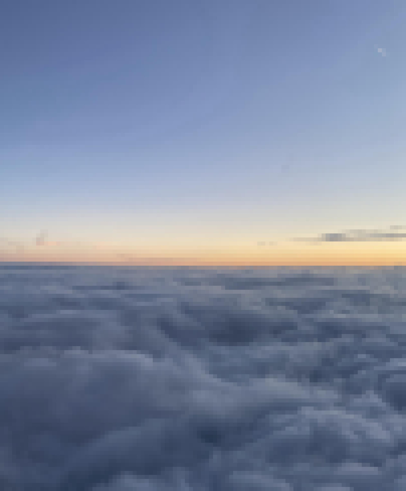

# pixelate

Pixelates images. Just a fun evening project.

**Before:**


**After:**

## Usage

```plaintext
$ python3 pixelate.py --from_path <from_path> --to_path <to_path> --square_size <square_size>
```
Arguments:
- `from_path`: The path to the original image to be pixelated.
- `to_path`: The path to save the pixelated image to.
- `square_size` The size of a single square as an integer.

All required packages are in `requirements.txt`.

